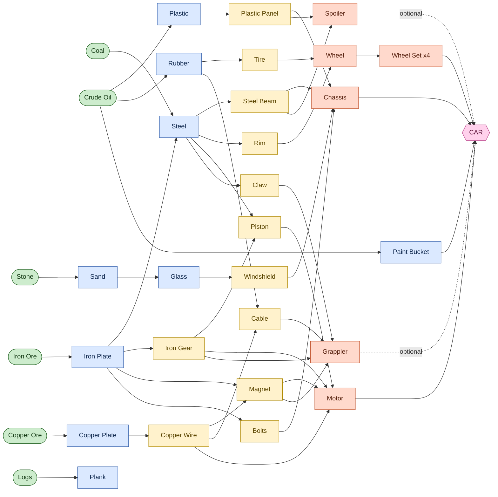

# 🏭🚗 Fabrik — A Factory Game for Young Builders

> Build a factory, make a car, drive it, race it, and grab your friends with a magnet claw!
> A gentle 2D factory-building game inspired by Factorio, designed for children aged **6–8**.

---

## Table of Contents

1. [Game Vision](#1-game-vision)
2. [Design Principles (for ages 6–8)](#2-design-principles-for-ages-68)
3. [Platform & Technology](#3-platform--technology)
4. [The Core Loop](#4-the-core-loop)
5. [The World: Biomes, Map & Seeds](#5-the-world-biomes-map--seeds)
6. [The Player Character](#6-the-player-character)
7. [Controls](#7-controls)
8. [Logistics: Belts, Grabber Arms & Pipes](#8-logistics-belts-grabber-arms--pipes)
9. [Machines & Buildings Catalog](#9-machines--buildings-catalog)
10. [Base Resources](#10-base-resources)
11. [The Full Tech Tree](#11-the-full-tech-tree)
12. [Recipe Tables](#12-recipe-tables)
13. [Refineries & the Color System](#13-refineries--the-color-system)
14. [The Car](#14-the-car)
15. [Driving, Racing & the Grappler](#15-driving-racing--the-grappler)
16. [Villagers & Car Orders (the Endgame Loop)](#16-villagers--car-orders-the-endgame-loop)
17. [Milestones 1–10](#17-milestones-110)
18. [User Interface & HUD](#18-user-interface--hud)
19. [Sprocket: the Helper Robot](#19-sprocket-the-helper-robot)
20. [Saving & Worlds](#20-saving--worlds)
21. [Accessibility](#21-accessibility)
22. [Art & Audio Direction](#22-art--audio-direction)
23. [Out of Scope / Future Ideas](#23-out-of-scope--future-ideas)
24. [Glossary of Icons](#24-glossary-of-icons)

---

> ## 🛠️ This repository contains a working game
>
> The sections below are the **design spec**. A **playable implementation** lives
> alongside it:
> - **Play now:** double-click `index.html` (no build step). See **[HOWTO_RUN.md](HOWTO_RUN.md)**.
> - **Generate the art** with Google's Gemini image models: **[assets/README.md](assets/README.md)**.
> - The game ships with placeholder graphics, so it's playable before any art exists.
>
> **What's implemented:** seeded world + 7 biomes, walking & hand-mining, the full
> tech tree (34 items, 30 recipes), drills, conveyor **belts**, **grabber arms**,
> furnaces/assemblers/crusher/sawmill, the **oil → pipe → refinery** liquid chain,
> the multi-input **Car Factory**, milestone-gated tech (1→10), building cars,
> and **driving** them (with a grappler on the Super Car).
>
> **Simplifications vs. this spec (kid-friendliness / scope):** unlocked machines
> place for free (mining still matters for car *parts*); car colour is chosen at
> the Car Factory rather than via coloured paint on belts; races, villager orders,
> and the full milestone-8/9/10 set-pieces are scaffolded around the same systems
> but not all fleshed out yet. Everything here is the north star.

## 1. Game Vision

**Fabrik** is a friendly, top-down 2D factory game. A child explores a colorful, procedurally generated world; gathers raw materials like **Iron** and **Oil**; places machines, conveyor belts, and pipes to turn those materials into parts; and combines the parts into **Cars**. The big goal is to build a factory that can build cars — and then **drive and race those cars**, including silly grappler battles.

There is **no way to lose**. There are no enemies. Every challenge is friendly, every mistake is fixable, and progress is celebrated loudly with confetti, sounds, and a cheerful helper robot.

The game teaches, without ever saying so: cause and effect, sequencing ("first this, then that"), counting, planning, spatial reasoning, and the joy of building a system that runs by itself.

---

## 2. Design Principles (for ages 6–8)

These principles override any other design temptation. When in doubt, choose the simpler, kinder option.

- **You cannot lose and you cannot break anything permanently.** No death, no game-over, no starvation, no decay. Anything you place can be picked back up and refunded in full.
- **Short words + big icons.** Assume the child can read short words ("Iron", "Belt", "Go!"). Every word is paired with a picture. Long sentences are spoken aloud by Sprocket, never required reading.
- **One new idea at a time.** Each milestone introduces at most one new concept. New machines unlock only when the child is ready for them.
- **Always a next step.** The child should never wonder "what now?". Sprocket and the milestone card always point at the next thing, with an on-map arrow.
- **Bite-sized sessions.** Each milestone is a complete, satisfying chunk (earlier ones shorter, ~5–8 min; later ones longer, up to ~15–20 min). Auto-save means a child can stop any time.
- **Forgiving controls.** Big hit-boxes, snapping-to-grid, "ghost" previews before placing, generous timing, no twitchy precision.
- **Celebrate everything.** Finishing a recipe, a milestone, a delivery, a race — all get sound, sparkles, and praise.
- **Calm by default.** Soft music, gentle pacing, no timers that punish, no flashing.

---

## 3. Platform & Technology

| Item | Decision |
|---|---|
| **Platform** | Web browser (desktop). Runs as a single-page HTML5 game. |
| **Primary input** | **Keyboard** for movement and actions, **mouse** for placing/rotating machines and menus. |
| **Rendering** | 2D tile-based, top-down. Recommended: HTML5 Canvas / WebGL (e.g. a lightweight engine such as Phaser or PixiJS, or custom Canvas). |
| **Resolution** | Scales to the browser window; pixel-art assets at a base tile size of **32×32 px**, integer-scaled. |
| **Performance target** | Smooth 60 fps on a modest school laptop / Chromebook with hundreds of belts and dozens of machines. |
| **Persistence** | Local save via **IndexedDB** (with `localStorage` fallback). No account or internet required. |
| **Offline** | Fully playable offline after first load (PWA-style caching recommended). |
| **Audio** | Web Audio. All instructions also available as recorded voice-over (Sprocket). |

---

## 4. The Core Loop

```
   ┌─────────────────────────────────────────────────────────────┐
   │                                                             │
   ▼                                                             │
EXPLORE  ──►  GATHER  ──►  BUILD MACHINES  ──►  AUTOMATE  ──►  MAKE PARTS
the map      iron, oil    drills, furnaces,     belts +        gears, wheels,
(find        wood...      assemblers...         grabber arms   motors...
patches)                                                          │
   ▲                                                              ▼
   │                                                         MAKE A CAR
   │                                                              │
   │                                                              ▼
   │                                                    DRIVE / RACE / GRAPPLE
   │                                                              │
   │                                                              ▼
   └──────────────────────────  FULFILL VILLAGER ORDERS ◄─────────┘
                                 (unlocks cooler cars & areas)
```

A child does this many times at increasing scale: the first car needs a tiny factory; the championship grappler-car needs a sprawling one.

---

## 5. The World: Biomes, Map & Seeds

### 5.1 Map shape

- The world is **bounded** but **large**: roughly **8 × 8 screens** (~**240 × 160 tiles**), giving plenty of room to explore and to sprawl out a big factory. A soft, decorative border (mountains / ocean / hedges) marks the edge — the player simply cannot walk past it (no fall, no danger).
- The camera follows the player smoothly. A **mini-map** in the corner shows discovered areas, resource patches, your base, and quest markers.

### 5.2 Seeds (visible "magic words")

- On **New World**, the child picks a **magic word** as the seed (e.g. type `RAINBOW` or `DINO`, or press 🎲 for a random one).
- The same word always makes the same world, so kids can share words ("Try my world: `BANANA`!").
- The seed deterministically generates biome layout, resource patch positions, rivers, decorations, and villager homes.

### 5.3 Biomes

Resources are tied to biomes, so exploration has purpose. Patches are **brightly color-coded** and have a distinct **icon and shape** (also helps colorblind players). Exploration is required but gentle — the nearest patch of each early resource is never far from spawn.

| Biome | Look | Resources found here | Notes |
|---|---|---|---|
| 🌼 **Meadow** | Green grass, flowers | (Starting area) | Where the player spawns. Flat, easy to build on. |
| 🌳 **Forest** | Dense trees | **Wood (Logs)** | Trees are gentle obstacles you can harvest. |
| ⛰️ **Rocky Hills** | Gray rock, cliffs | **Iron Ore, Copper Ore, Coal** | The "metal" biome. |
| 🏜️ **Quarry / Desert** | Sand dunes, boulders | **Stone** | Open and sandy. |
| 🛢️ **Oily Marsh** | Dark bubbly pools | **Crude Oil** | The only liquid source; needs a Pump. |
| 🏖️ **Lakeshore** | Water, beach | (decorative + bridge crossings) | Pretty; gentle water obstacles. |
| 🌈 **Rainbow Hills** | Pastel hills | (special décor, late-game scenery) | An unlocked-feeling, lovely place to drive. |

### 5.4 Gentle obstacles (never enemies)

All obstacles are friendly puzzles, never threats:

- **Boulders / rocks** — clear them by mining (gives a little Stone). Block belt paths until removed.
- **Trees** — harvest for Wood, or leave as decoration.
- **Rivers / water** — cross by placing a **Bridge** tile (cheap, unlocked early). Belts and the player can cross bridges.
- **Bushes & flowers** — purely decorative; walk through freely.

There is no fog-of-war danger — just undiscovered (dimmed) map that brightens as you explore.

---

## 6. The Player Character

- A cute, customizable child-avatar (choose hat/color at start; purely cosmetic).
- **Movement:** walks in 8 directions, smooth and snappy. No stamina, no fall damage.
- **Mining by hand:** walk up to a resource node, hold the **Action** key, and a little progress ring fills; the item pops into your backpack. Hand-mining is slow — it's the bootstrap before you build machines.
- **Backpack (inventory):** effectively **unlimited capacity** (a very high cap the child will never hit). No inventory-management stress. Items are shown as a tidy grid of icons with counts.
- **Hand-crafting (bootstrap):** from the backpack, the child can hand-craft a small set of **basic items** (e.g. the first Drill, first Belt, Furnace) so they can get started before automation exists. Hand-craft recipes for these starter items are intentionally tiny. Everything fancier must be **made by machines** — that's the whole point of the game.
- **Build tool:** select a machine from the hotbar/build menu, see a translucent **ghost preview** snapped to the grid, click (or press Action) to place. **Pick-up tool** (or right-click) removes a placed thing and refunds it 100%.

---

## 7. Controls

### 7.1 On Foot

| Action | Key(s) | Mouse |
|---|---|---|
| Move | **Arrow keys** or **WASD** | — |
| Mine / Interact / Confirm | **Space** or **E** (hold to mine) | Left-click on node/machine |
| Open Build Menu | **B** | Click the 🧰 button |
| Place selected machine | **Space / E** | **Left-click** (ghost preview snaps to grid) |
| Rotate machine before/after placing | **R** | Scroll wheel |
| Pick up / remove (refund) | **X** | **Right-click** |
| Select hotbar slot | **1 – 9** | Click slot |
| Open Recipe Picker (on a selected machine) | **E** on the machine | Click the machine |
| Mini-map zoom | **M** | Click mini-map |
| Pause / Menu | **Esc** | Click ⏸️ |
| Help (call Sprocket) | **H** | Click 🤖 |

Mouse and keyboard work together: a child can place machines by clicking, or entirely by keyboard if they prefer. Big snap-to-grid targets make precision unnecessary.

### 7.2 Driving a Car

| Action | Key(s) |
|---|---|
| Enter / exit nearest car | **E** |
| Accelerate | **↑ / W** |
| Brake / Reverse | **↓ / S** |
| Steer | **← → / A D** |
| Handbrake (fun drift) | **Space** |
| Fire / aim **Grappler** | **F** (aim with steering; auto-targets nearest grabbable) |
| Drop grappled item | **F** again, or **G** |
| Horn 🔊 | **H** |

Driving uses gentle arcade physics — easy to control, hard to crash badly (cars bounce softly off obstacles, never "break").

---

## 8. Logistics: Belts, Grabber Arms & Pipes

The factory moves two kinds of stuff: **solid items** (on belts) and **liquid oil** (in pipes). Solids and liquids never mix up — they use different-looking carriers.

### 8.1 Conveyor Belts (solids)

- Carry solid items in the direction of the arrow printed on them.
- Placed by **click-and-drag** to draw a line of belts quickly (kid-friendly painting). Corners auto-shape.
- **Rotatable** with **R**. Belts show clear moving arrows so the flow is always visible.
- Belts **do not** load machines by themselves — see Grabber Arms.

### 8.2 Grabber Arms (load & unload machines)

> Per the chosen design, machines are fed by a simple **Grabber Arm** — one easy part that picks an item off a belt and puts it into a machine (or takes a finished item out and drops it on a belt).

- A Grabber Arm sits between a belt and a machine. Place it, point it (it shows a clear "grab here ➜ drop there" arrow).
- One Grabber Arm type only (no fast/long/filter variants in the base game) to keep it simple. It auto-grabs whatever the adjacent machine needs and ignores the rest.
- Visual feedback: the arm physically swings, so kids can see it working — and see when it's idle (nothing to grab) so they can debug.

### 8.3 Pipes (liquid oil)

- **Pipes** carry **Crude Oil** from an **Oil Pump** to a **Refinery**.
- Drawn like belts (click-drag). They glow with flowing oil so the child can see it moving.
- Pipes only ever carry **oil** (the only liquid in the game). Refineries take oil **in** via pipe and put **solid** products **out** onto a belt — so the child never has to manage more than one liquid.

### 8.4 Optional helpers (unlocked later, never required)

- **Storage Box** 📦 — holds items; a buffer/parking spot for goods. Grabber Arms can load/unload it.
- **Splitter** ↔️ (late unlock) — sends items down two belts evenly. Introduced only at higher milestones for kids who want bigger factories; never required to finish the game.

---

## 9. Machines & Buildings Catalog

Every machine snaps to the grid, can be rotated, and can be picked up for a **full refund**. Machines **never need power or fuel** — they "just work" when ingredients arrive. Machines accept **1 to 6 inputs** depending on type, satisfying the whole range.

| # | Machine | Icon | Inputs | Output | What it does | Unlock |
|---|---|---|---|---|---|---|
| 1 | **Drill** | ⛏️ | (sits on a node) | 1 item type | Mines a solid resource node (iron, copper, coal, stone, wood) onto a belt. | M1 |
| 2 | **Furnace** | 🔥 | 1–3 | 1 | Smelts ore→plate, makes Steel & Glass. | M1 |
| 3 | **Conveyor Belt** | ➡️ | — | — | Carries solids. | M2 |
| 4 | **Grabber Arm** | 🦾 | — | — | Loads/unloads machines from/to belts. | M2 |
| 5 | **Storage Box** | 📦 | — | — | Buffers items. | M2 |
| 6 | **Assembler (Workshop)** | 🔧 | 1–5 | 1 | The workhorse. Pick a recipe; combines parts into a component. | M3 |
| 7 | **Crusher** | 🪨 | 1 | 1 | Crushes Stone → Sand. | M3 |
| 8 | **Sawmill** | 🪚 | 1 | 1 | Cuts Logs → Planks. | M3 |
| 9 | **Oil Pump** | ⛽ | (sits on oil) | oil→pipe | Pumps Crude Oil into pipes. | M4 |
| 10 | **Pipe** | 🟢 | — | — | Carries oil. | M4 |
| 11 | **Refinery** | 🛢️ | 1 (oil) + setting | 1 solid | Turns oil into Plastic, Rubber, or **Paint (chosen color)**. | M4 |
| 12 | **Bridge** | 🌉 | — | — | Lets belts & the player cross water. | M4 |
| 13 | **Car Factory** | 🏭 | **up to 6** | 1 Car | The grand assembler that builds Cars. | M7 |
| 14 | **Parking Lot** | 🅿️ | (cars delivered) | — | Finished cars appear here, ready to drive. | M7 |
| 15 | **Order Board** | 📋 | — | — | Villagers post car orders here; deliver for rewards. | M8 |
| 16 | **Splitter** | ↔️ | — | — | Splits a belt into two (optional, big factories). | M9 |

### Machine behavior rules (for implementers)

- A machine with a chosen recipe shows **ghost icons** of the ingredients it's waiting for, and a progress bar while crafting.
- If an input is missing, the machine politely idles (no error, no penalty) and shows the missing ingredient icon so a child can see *why* it stopped.
- Output buffers a few items; if the output isn't taken away, the machine pauses (back-pressure) — taught gently in a milestone.
- **Refund rule:** picking up a machine returns it **and** any ingredients currently inside it.

---

## 10. Base Resources

Six base resources keep the tree rich but understandable. Two are the required **Iron** and **Oil**; the rest support an interesting tech tree.

| Resource | Icon | Source biome | Gathered by | Leads to |
|---|---|---|---|---|
| **Iron Ore** | 🪨⚙️ | Rocky Hills | Hand / Drill | Iron Plate, Steel, Gears, Magnets |
| **Copper Ore** | 🟠 | Rocky Hills | Hand / Drill | Copper Plate, Wire, Magnets |
| **Coal** | ⚫ | Rocky Hills | Hand / Drill | Steel |
| **Stone** | 🪨 | Quarry | Hand / Drill | Sand → Glass |
| **Wood (Logs)** | 🪵 | Forest | Hand / Drill | Planks (early builds, décor) |
| **Crude Oil** | 🛢️ | Oily Marsh | Oil Pump | Plastic, Rubber, **Paint** |

> *Liquids:* only **Crude Oil** is a liquid. Everything else is a solid carried on belts. This keeps the pipe system to a single, easy-to-understand fluid.

---

## 11. The Full Tech Tree

The tree has up to **5 tiers** from raw resource to finished Car. Every recipe is made by a machine (except the tiny hand-craft bootstrap items). Below is the complete dependency graph, followed by exact recipe tables in §12.



### The car at a glance

```
                          ┌──────────────┐
                          │     CAR      │
                          └──────┬───────┘
        ┌──────────┬───────────┬─┴────────┬───────────┬───────────┐
        ▼          ▼           ▼          ▼           ▼           ▼
    CHASSIS     MOTOR     WHEEL SET    PAINT      SPOILER     GRAPPLER
   (body)     (engine)   (4 wheels)   (color)   (optional)  (optional)
```

---

## 12. Recipe Tables

All quantities are tuned for fun, not realism, and can be balanced during playtesting. "**Machine**" is where the recipe is made.

### Tier 1 — Primary processing

| Output | Machine | Inputs |
|---|---|---|
| **Iron Plate** | Furnace | 1 Iron Ore |
| **Copper Plate** | Furnace | 1 Copper Ore |
| **Steel** | Furnace | 2 Iron Plate + 1 Coal |
| **Sand** | Crusher | 1 Stone |
| **Glass** | Furnace | 1 Sand |
| **Plank** | Sawmill | 1 Log |
| **Plastic** | Refinery | 1 Crude Oil |
| **Rubber** | Refinery | 1 Crude Oil |
| **Paint Bucket** (color) | Refinery | 1 Crude Oil *(+ chosen color setting)* |

### Tier 2 — Components (Assembler)

| Output | Machine | Inputs |
|---|---|---|
| **Iron Gear** | Assembler | 2 Iron Plate |
| **Copper Wire** | Assembler | 1 Copper Plate → 2 Wire |
| **Magnet** | Assembler | 1 Iron Plate + 1 Copper Wire |
| **Bolts** | Assembler | 1 Iron Plate → 4 Bolts |
| **Steel Beam** | Assembler | 2 Steel |
| **Plastic Panel** | Assembler | 2 Plastic |
| **Tire** | Assembler | 2 Rubber |
| **Rim** | Assembler | 1 Steel |
| **Piston** | Assembler | 1 Steel + 1 Iron Gear |
| **Cable** | Assembler | 1 Copper Wire + 1 Rubber |
| **Claw** | Assembler | 2 Steel |
| **Windshield** | Assembler | 2 Glass |

### Tier 3 — Car Parts (Assembler / multi-input)

| Output | Machine | Inputs (count) |
|---|---|---|
| **Wheel** | Assembler | 1 Tire + 1 Rim (2) |
| **Wheel Set** | Assembler | 4 Wheels (1 input, qty 4) |
| **Motor** | Assembler | 2 Iron Gear + 2 Copper Wire + 1 Magnet + 1 Piston (**4 inputs**) |
| **Chassis** | Assembler | 2 Steel Beam + 2 Plastic Panel + 1 Windshield + 4 Bolts (**4 inputs**) |
| **Spoiler** | Assembler | 2 Plastic Panel + 1 Steel Beam (2 inputs) |
| **Grappler** | Assembler | 1 Claw + 2 Cable + 1 Magnet + 1 Iron Gear (**4 inputs**) |

### Tier 4 — Final Assembly (Car Factory, up to 6 inputs)

| Car type | Machine | Inputs (count) | Result |
|---|---|---|---|
| **Basic Car** | Car Factory | 1 Chassis + 1 Motor + 1 Wheel Set + 1 Paint Bucket (**4**) | A drivable car in the chosen color. |
| **Sporty Car** | Car Factory | + 1 Spoiler (**5**) | Faster, better handling. |
| **Super Car** | Car Factory | + 1 Grappler (**6**) | Top stats **and** can grapple things while driving. |

> The **Car Factory** is the only machine that uses all **6** input slots — the dramatic finale of the input range (1–6).

---

## 13. Refineries & the Color System

The **Refinery** is the bridge from liquid to solid. It takes **Crude Oil** in through a **pipe** and outputs a **solid** on a **belt**.

- Open the Refinery to pick its **recipe**: **Plastic**, **Rubber**, or **Paint**.
- When set to **Paint**, a friendly **color wheel** appears. The child picks a color (e.g. ❤️ Red, 💙 Blue, 💚 Green, 💛 Yellow, 🧡 Orange, 💜 Purple, 🖤 Black, 🤍 White, plus a few "cool" colors like ✨ Gold and 🌈 Rainbow unlocked late).
- The Refinery then produces **Paint Buckets of that color**, which travel on belts to the Car Factory.
- **Color matters for play:** villager orders ask for specific colors (§16), so the child learns to set the Refinery on purpose. The chosen Paint color becomes the car's color.

Multiple Refineries can be set to different colors to run several color lines at once — a natural "bigger factory" lesson in late milestones.

---

## 14. The Car

A finished Car is an object placed on the **Parking Lot**. The player walks up and presses **E** to get in.

### 14.1 Required parts

- **Chassis** — the body & frame (with windshield).
- **Motor** — the engine; makes it go.
- **Wheel Set** — four wheels.
- **Paint** — the color (also the car's look).

### 14.2 Optional parts (the "cool factor")

| Part | Effect when added |
|---|---|
| **Spoiler** | **+Top speed and +handling.** Visibly attaches to the back. The "fast car" upgrade. |
| **Grappler** | A **magnet claw** on the front. While driving, press **F** to grab a nearby object (rock, log, treasure, **or another car!**), carry it, and drop/throw it. Pure fun + race tactics. |

### 14.3 Car stats (simple, visible)

Each car shows three big star-meters in the garage so kids can compare:

| Stat | Driven by |
|---|---|
| 🏎️ **Speed** | Base + Spoiler bonus |
| 🌀 **Handling** | Base + Spoiler bonus |
| 🧲 **Grab** | Only if a Grappler is fitted |

The child can build many cars and keep a whole fleet; cars persist in the world and in the save.

---

## 15. Driving, Racing & the Grappler

Driving is the reward, and it has several flavors (all requested):

### 15.1 Free-roam discovery
Drive anywhere on the map. Hidden goodies reward exploration: **ramps to jump**, **decorations to find**, scenic spots in 🌈 Rainbow Hills, and little surprises. No pressure, no timer.

### 15.2 Grappler play & puzzles
With a Grappler car, use **F** to pick up boulders, logs, and treasure, then stack, move, or fling them. Gentle physics-y sandbox fun. Some optional puzzle spots ("move these three boulders onto the pads") give a small reward.

### 15.3 Time trials (race track)
A built-in **Race Track** (unlocked M9). Drive laps and beat your best time. **Spoiler cars go faster** → better times. Earn 🥉🥈🥇 medals. Friendly, beat-your-own-best framing.

### 15.4 Races vs. other cars — with grappler combat (the big finale)
Race against cheerful AI opponents. The twist (requested): with a **Grappler**, you can **grab an opponent's car and throw it off the track** to get ahead — and they can do gentle versions back. It's slapstick, never mean: thrown cars softly bounce back onto the track a moment later, no damage, lots of giggles. Win the **Championship** in the final milestone.

### 15.5 Delivery / fetch quests
Villagers sometimes ask you to **drive a car or an item somewhere**. Hop in, drive it over, get a happy reward. Gives cars an everyday purpose beyond racing.

---

## 16. Villagers & Car Orders (the Endgame Loop)

Once the first car exists, friendly **Villagers** (a bear, a fox, a bunny, a robot, etc.) give the child a reason to keep building.

- An **Order Board** 📋 (unlocked M8) shows requests as **picture cards**:
  > 🐻 *"I'd love a **RED** car!"* → reward: ⭐ + unlock
  > 🦊 *"A **BLUE** car with a **SPOILER**, please!"*
  > 🤖 *"A **GOLD SUPER CAR** with a **GRAPPLER**!"* (late game)
- The child reads the card (short words + icons), configures the factory (right **color**, right **optional parts**), builds the car, and **drives or delivers** it to the villager.
- Rewards: stars, decorations, new paint colors (Gold, Rainbow), new track unlocks, and happy villager animations.
- Orders **ramp up gently**: early ones are just a color; later ones want spoilers, then grapplers, then specific super-car combos — naturally pushing the child to expand the factory and master the whole tree.

This is the loop that keeps the game going after the first car: **demand → build on purpose → deliver → reward → bigger demand.**

---

## 17. Milestones 1–10

Milestones are the spine of the game. Each one:

- Is presented as a friendly **card** with a picture goal and short words (Sprocket reads it aloud).
- Introduces **one** new idea and **unlocks** the machines/recipes needed (milestone-gated tech).
- Shows an **on-map arrow / highlight** toward the next action.
- Ends with a **celebration** (confetti, sound, a new toy unlocked).
- Targets a bite-sized play chunk (earlier shorter, later longer). Auto-saves on completion.

Difficulty rises smoothly: more steps, more resources, deeper recipes, bigger factories.

---

### 🟢 Milestone 1 — "First Sparks" *(~5 min)*
- **Story:** Sprocket the robot crash-lands. "Let's make some metal!"
- **Unlocks:** **Drill**, **Furnace**, hand-mining.
- **Learn:** Mine **Iron Ore** (by hand, then with a Drill) and smelt it in a Furnace.
- **Goal:** Produce **10 Iron Plates**.
- **Reward:** ⭐ + a shiny plate badge. Sprocket cheers.

### 🟢 Milestone 2 — "Belt It Out" *(~6 min)*
- **Unlocks:** **Conveyor Belt**, **Grabber Arm**, **Storage Box**.
- **Learn:** Use belts + grabber arms so the Drill feeds the Furnace and plates flow into a Box — **automatically**, no hands.
- **Goal:** Auto-deliver **20 Iron Plates** into a Storage Box (you don't touch them).
- **Reward:** ⭐ + "Hands-Free!" badge.

### 🟢 Milestone 3 — "The Workshop" *(~8 min)*
- **Unlocks:** **Assembler**, **Crusher**, **Sawmill**; mining **Copper**, **Stone**, **Wood**.
- **Learn:** The Assembler combines parts. Make **Iron Gears** and **Copper Wire**.
- **Goal:** Auto-produce **10 Iron Gears** and **10 Copper Wire**.
- **Reward:** ⭐ + "Maker" badge.

### 🟡 Milestone 4 — "Wheels!" *(~12 min)*
- **Unlocks:** **Oil Pump**, **Pipe**, **Refinery**, **Bridge**; **Steel** recipe.
- **Learn:** Pump **Oil** → pipe → Refinery → **Rubber**. Smelt **Steel** (Iron + Coal). Build **Tires** + **Rims** → **Wheels** → a **Wheel Set**.
- **Goal:** Produce **1 Wheel Set** (your first car part!).
- **Reward:** ⭐ + "On a Roll" badge. (First taste of oil + the first car part.)

### 🟡 Milestone 5 — "Heart of the Machine" *(~14 min)*
- **Unlocks:** **Magnet**, **Piston** recipes.
- **Learn:** Multi-input assembling. Build a **Motor** from Gears + Wire + Magnet + Piston (4 inputs).
- **Goal:** Produce **1 Motor**.
- **Reward:** ⭐ + "Engine Master" badge.

### 🟡 Milestone 6 — "Strong Body" *(~14 min)*
- **Unlocks:** **Glass → Windshield**, **Steel Beam**, **Plastic Panel**, **Bolts**.
- **Learn:** Deeper supply chains (sand→glass→windshield; plastic→panel). Build a **Chassis**.
- **Goal:** Produce **1 Chassis**. (Now you have Wheels + Motor + Chassis!)
- **Reward:** ⭐ + "Body Builder" badge.

### 🟠 Milestone 7 — "Paint & Go!" — **FIRST CAR** *(~15 min)*
- **Unlocks:** **Refinery Paint mode + color wheel**, **Car Factory**, **Parking Lot**.
- **Learn:** Set a Refinery to make **Paint** of a color. Feed Chassis + Motor + Wheel Set + Paint into the **Car Factory** (4 of 6 inputs).
- **Goal:** Build your **first Car**, watch it roll onto the **Parking Lot**, **get in and DRIVE!** 🎉
- **Reward:** ⭐⭐ + big confetti, free-roam driving unlocked, your name on the car.

### 🟠 Milestone 8 — "Open for Business" *(~15 min)*
- **Unlocks:** **Order Board**, **Villagers**, **delivery quests**, **free-roam goodies**.
- **Learn:** Read a villager's order, set the right **paint color on purpose**, build & **deliver** the car.
- **Goal:** Fulfill **3 villager orders** (different colors).
- **Reward:** ⭐⭐ + new colors unlocked + happy villagers.

### 🔴 Milestone 9 — "Need for Speed" *(~18 min)*
- **Unlocks:** **Spoiler** recipe, **Race Track**, **Splitter** (optional), time trials.
- **Learn:** Add an optional part. Build a **Sporty Car** (with Spoiler, 5 inputs) — it's faster.
- **Goal:** Build a spoiler car and **earn a 🥇 medal** on the Race Track time trial.
- **Reward:** ⭐⭐ + "Speed Star" badge + ✨ Gold paint unlocked.

### 🔴 Milestone 10 — "The Grand Grappler" — **CHAMPIONSHIP** *(~20 min)*
- **Unlocks:** **Grappler** recipe, **car-vs-car races**, **grappler-throw**, 🌈 Rainbow paint.
- **Learn:** Build the ultimate **Super Car** (Chassis + Motor + Wheel Set + Paint + Spoiler + **Grappler** = all **6 inputs**).
- **Goal:** Win the **Championship Race** — use the **Grappler (F)** to grab and **fling opponents off the track**, and dodge theirs, to cross the line first.
- **Reward:** 🏆 trophy + endless **sandbox mode**: build any car, keep filling fancy villager orders, race, and grapple forever.

> **After Milestone 10:** the world stays open. New, harder villager orders keep appearing (specific super-car combos), all colors and tracks are available, and the child can build an enormous factory and a whole fleet of cars at their own pace.

### Milestone difficulty curve (summary)

| M | Title | New idea | New machines | Car part | ~Time |
|---|---|---|---|---|---|
| 1 | First Sparks | Mine & smelt | Drill, Furnace | — | 5 |
| 2 | Belt It Out | Automate flow | Belt, Grabber Arm, Box | — | 6 |
| 3 | The Workshop | Assemble parts | Assembler, Crusher, Sawmill | — | 8 |
| 4 | Wheels! | Oil & refining | Pump, Pipe, Refinery, Bridge | **Wheel Set** | 12 |
| 5 | Heart of the Machine | Multi-input | — | **Motor** | 14 |
| 6 | Strong Body | Deep chains | — | **Chassis** | 14 |
| 7 | Paint & Go! | Build a car & drive | Car Factory, Parking Lot | **CAR** 🎉 | 15 |
| 8 | Open for Business | Orders & color | Order Board | (on demand) | 15 |
| 9 | Need for Speed | Optional spoiler & racing | Race Track, Splitter | **Spoiler** | 18 |
| 10 | Grand Grappler | Grappler & combat races | (Grappler unlock) | **Grappler** 🏆 | 20 |

---

## 18. User Interface & HUD

Everything is **icon-first**, with short words and optional voice-over. Big buttons, high contrast, generous spacing.

- **Hotbar (bottom):** numbered slots **1–9** of placeable items, each a big icon with a count.
- **Build Menu (B / 🧰):** a grid of available machines, grouped (Mining / Move / Make / Cars). Locked items show a 🔒 with the milestone that unlocks them.
- **Milestone Card (top-left):** current goal as a picture + short text + progress (e.g. "Iron Plates: 7 / 10"), with a **"Show me" arrow** button that points on-map.
- **Mini-map (top-right):** discovered terrain, resources, base, quest markers, your car(s).
- **Machine panel (click a machine):** recipe picker (big ingredient icons), live progress bar, and a "missing ingredient" hint if idle.
- **Backpack (Tab):** grid of carried items with counts; hand-craft panel for bootstrap items.
- **Help (H / 🤖):** calls Sprocket for a spoken hint about the current goal.
- **Praise pop-ups:** confetti + sound on any completed recipe/milestone/delivery/race.

No tiny text, no nested menus deeper than two levels, no modal that can't be closed with **Esc**.

---

## 19. Sprocket: the Helper Robot

**Sprocket** is the friendly mascot and tutor.

- Appears at the start, sets up each milestone, and explains one idea at a time with a short spoken line + picture.
- Pressing **H** asks Sprocket for a hint about the **current** goal ("You need Rubber — pump some oil into a Refinery!"), and points an arrow at what to do.
- Notices when the child is stuck (e.g., a machine idle for a while) and gently offers help — never nags, never blocks play.
- Celebrates wins with the child.
- Fully skippable for confident kids (a "Let me explore" button).

---

## 20. Saving & Worlds

- **Multiple named Worlds**, each created from a **magic word** seed. Shown as cards on the title screen with a thumbnail and progress (e.g. "Milestone 6 / 10").
- **Auto-save** continuously and on every milestone, so a child can stop at any moment and resume exactly where they left off.
- Saves include: map + seed, all placed machines/belts/pipes and their contents, inventory, milestone progress, unlocked tech, built cars & their stats, villager order state, medals/trophies.
- **No accounts, no internet.** Local-only (IndexedDB). Optional **export/import a World** as a file so kids can share builds (offline).

---

## 21. Accessibility

- **Colorblind-friendly:** every resource/item has a **distinct shape + icon**, not just color. Paint colors include labels/patterns.
- **Reading support:** all text is short; everything important is **spoken** by Sprocket; icons everywhere.
- **Motor-skill friendly:** big hit-boxes, snap-to-grid, click-drag belt drawing, no precise timing, generous targets.
- **Calm mode option:** reduce screen-shake/particles; softer sounds.
- **Remappable keys** and full mouse-only or keyboard-only play.
- **No reading-required fail states** — you literally cannot fail.

---

## 22. Art & Audio Direction

- **Style:** bright, rounded, friendly cartoon pixel-art. Chunky, readable shapes at 32×32. High contrast, cheerful palette.
- **Animation:** machines visibly move (gears turn, arms swing, belts scroll, oil flows) so a child can *see* the factory working — and see where it's stuck.
- **Cars:** distinct silhouettes; spoiler and grappler are clearly visible add-ons; paint color is obvious.
- **Audio:** soft, loopy background music; satisfying "chunk/ding/whoosh" SFX for placing, crafting, and completing; cheerful jingles for milestones and races; villager and Sprocket voice-over.
- **Feedback:** confetti and sparkles for every success; gentle bonk (no damage) for bumps.

---

## 23. Out of Scope / Future Ideas

Deliberately **not** in the base game (to protect the 6–8 experience):

- Power/electricity, fuel, pollution, enemies/combat damage, hunger/health.
- More than one liquid; complex fluid networks; circuit/logic networks.
- Online multiplayer or accounts.

Possible **future** additions (post-launch, optional): local two-player co-op (two avatars), a creative "free build" sandbox with everything unlocked, seasonal décor, more biomes/colors, a "blueprint" stamp for big builds, more vehicle types (trucks, boats).

---

## 24. Glossary of Icons

| Icon | Meaning | Icon | Meaning |
|---|---|---|---|
| ⛏️ Drill | Mines solids | 🔥 Furnace | Smelts |
| ➡️ Belt | Moves solids | 🦾 Grabber Arm | Loads machines |
| 📦 Box | Stores items | 🔧 Assembler | Makes components |
| 🪨 Crusher | Stone→Sand | 🪚 Sawmill | Logs→Planks |
| ⛽ Pump | Pumps oil | 🟢 Pipe | Moves oil |
| 🛢️ Refinery | Oil→solids/paint | 🌉 Bridge | Cross water |
| 🏭 Car Factory | Builds cars | 🅿️ Parking Lot | Cars wait here |
| 📋 Order Board | Villager orders | 🏆 Trophy | Championship |
| 🤖 Sprocket | Helper robot | 🎲 Dice | Random seed |

---

*Made for little builders. First you make the metal, then you make the parts, then you make the car — then you drive it, race it, and grab your friends with a magnet claw. 🏭➡️🚗💨*
